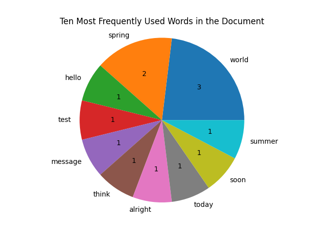

## Simple Text Analysis Tool
A simple text analysis tool witten in Python. Given a .txt file, the program produces a pie chart of the top 10 frequently used words in the document, as well as information about the word count and total number of times each word was used. 

## Motivation

This project is inspired by [Voyant Tools](https://voyant-tools.org/)! ~ Do check their site out, it's very fun and a great tool for text analysis.)

## Screenshots



## Dependencies 
This project uses [matplotlib](https://matplotlib.org/) and [nltk](https://www.nltk.org/). Be sure to `pip install <module-name>` before using!

For first-time nltk use, uncomment the line `nltk.download()`, run the program and download the corpora when the popup appears. Then you can comment the line and run the program as intended.


## How to use?
To use the program, type the command

  ```py text_analysis.py example_text.txt```
  
replacing example_text.txt with the .txt file to be analyzed.

## Contribute

Have any suggestions? Issues? Let me know in the [issues page](https://github.com/atreides1/Python-Text-Analysis-Tool/issues).
